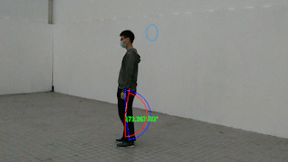

# Action_Learning_Project
- This project is for action estimation without any senser, it only use the video to estimate your action performance. The project have two part, one is the [UI system]( action_learning_UI ) , another is the [Core system](action_learning).

# Rusult 

### Unity Plugin

- Actions estimation 

     

- Different capture angle could work 

     

- Multiple person action reconigtion and estimation

     

# Limitaions 
